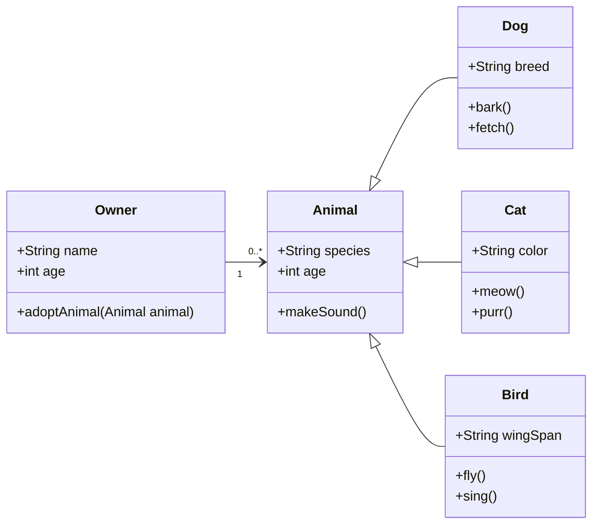
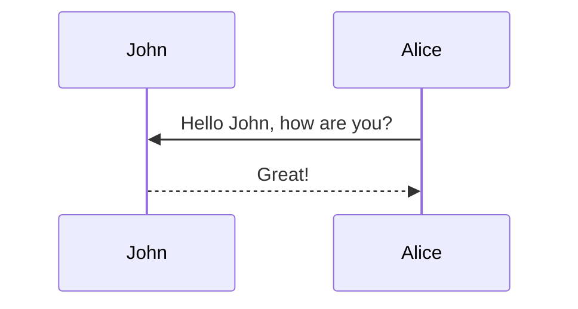

## Useless Title

````markdown

这里使用markdown代码块

- 一级列表
- 一级列表2
 - 二级列表
 - 二级列表2
(似乎没有用)

````
如果是直接在外面使用markdown语法呢？

- 一级列表
- 一级列表2
    - 二级列表
    - 二级列表2
        - 三级标题

似乎有点用


三个连字符 "---" 是分割不同部分

这里给出一个超链接： [谷歌搜索](https://www.google.com)

**Markdown** 的加粗字符， *斜体* 字符，和 ~~删除线~~ 字符

这里给出checkbox:

- [x] 什么也没学
- [ ] 学了一些
  - [x] 什么也没学
  - [ ] 学了一些
- [x] 什么也没学


---


## Tables

需要控制代码: pretty_table: true

| Left aligned | Center aligned | Right aligned |
| :----------- | :------------: | ------------: |
| Left 1       |    center 1    |       right 1 |
| Left 2       |    center 2    |       right 2 |
| Left 3       |    center 3    |       right 3 |


---


## mermaid

据说有个东西是mermaid，这里照抄代码

需要使用控制代码:
mermaid:
  enabled: true
  zoomable: true



